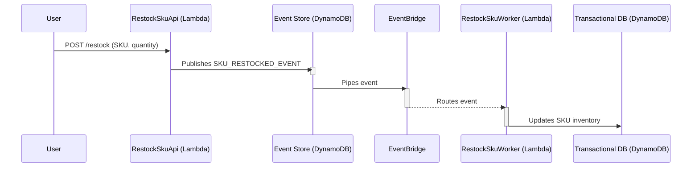
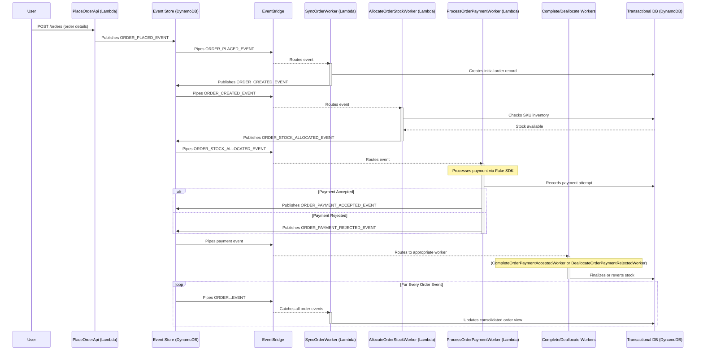

# Event-Driven Architecture POC using DynamoDB Streams, EventBridge, SQS, and Lambdas

This is a Proof of Concept for an event-driven architecture that uses DynamoDB as an event store, DynamoDB Streams to publish events, and EventBridge to route them to SQS queues where Lambda workers are listening.

It models a simplified fragment of an e-commerce application. The e-commerce part isn’t really that important; it's just an example. The focus is on the event-driven part and how the architecture behaves.

I think change data capture, event-driven architectures, DynamoDB, SQS, EventBridge, and Lambdas are all pretty cool, so I just wanted to build something putting it all together. Maybe at some point, it started as a kick-starter to have on hand for real-world projects (and that's still the plan), but this grew into more of an experiment with very specific flows, so there are few abstractions to be reused, at least for now (see the "Known Verbosity" section).

Being able to connect the parts of the "event driver" gets you real close to the events and provides great visibility into how they are produced, consumed, and how the system behaves and reacts to them. Having the events persisted in DynamoDB makes it easy to see what was going on and to tamper with the system by modifying or deleting things. It lets you cherry-pick events or transactional data, inspect the sequencing of events, manually produce events, test idempotency, and simulate chaos, all using the AWS console or the CLI.

---

## Table of Contents

- [A Couple of Notes Before You Dive In](#a-couple-of-notes-before-you-dive-in)
- [What Does This System Do: A High-Level Overview](#what-does-this-system-do-a-high-level-overview)
- [Architectural Principles](#architectural-principles)
- [How it Works](#how-it-works)
  - [The Event Producer-Consumer Mechanism](#the-event-producer-consumer-mechanism)
  - [Functional Architectural Components](#functional-architectural-components)
  - [Implementation Patterns](#implementation-patterns)
  - [Idempotency](#idempotency)
  - [The `doSomething` then `publishEvent` Pattern](#the-dosomething-then-publishevent-pattern)
  - [Error Handling & The `doSomething`/`publishEvent` Pattern](#error-handling--the-dosomethingpublishevent-pattern)
  - [Scenarios in Practice](#scenarios-in-practice)
- [Implemented Components & System Flow](#implemented-components--system-flow)
  - [Simulating Chaos](#simulating-chaos)
  - [Visualizing the Flows](#visualizing-the-flows)
- [Key Considerations & Known Verbosity](#key-considerations--known-verbosity)
- [Performance & Throughput](#performance--throughput)
- [Deployment & Setup](#important-note-for-windows-users)
  - [Important Note for Windows Users](#important-note-for-windows-users)
  - [How to Deploy](#how-to-deploy)
  - [How to Teardown](#how-to-teardown)
- [API Documentation](#api-documentation)
  - [RestockSkuApi](#restockskuapi)
  - [ListSkusApi](#listskusapi)
  - [PlaceOrderApi](#placeorderapi)
  - [ListOrdersApi](#listordersapi)
  - [ListOrderPayments](#listorderpaymentsapi)
  - [SimulateRawEventApi](#simulateraweventapi)
- [How to Test or Play With It](#how-to-test-or-play-with-it)

---

## A Couple of Notes Before You Dive In

Here are a few important clarifications to keep in mind while reading through this document.

1.  **It's a WIP:** Both the system and this README file are a work in progress. I tried to make this README complete enough so that it's understandable how the system and the architecture work, and to make it easy to deploy and play with. But most likely there are some gaps.

2.  **There are two versions of this Project:** Both were developed in parallel. One version **throws exceptions** and uses custom error classes to represent domain errors. The other version uses another common pattern where every operation **returns a `Success` or `Failure` object**. To avoid the hassle of maintaining two separate READMEs, I've tried to use neutral language here. When you see a phrase like **"produces an error"**, it's meant to cover both scenarios: throwing an exception or returning a `Failure` object.

    - These are the links to both projects (you are likely already in one of them):
      - [Throwing and catching exceptions error handling](https://github.com/mutchinick/dynamodb-eventbridge-driven-ecomm-nodejs-exceptions)
      - [Returning Success/Failure type error handling](https://github.com/mutchinick/dynamodb-eventbridge-driven-ecomm-nodejs-result)

3.  **On the term "Service":** You'll see the word "service" used in two different ways.

    - The first is the high-level **"Domain Service"** which represents a larger business scope, like the **Payments Service** or the **Orders Service**.
    - The second is the **"Service Class"** which is the core orchestrator inside each feature slice that handles the specific business logic for that operation.

4.  **A Note for Windows Users:** This repository uses long file paths which can exceed the default 260-character limit on Windows. This might cause a "Filename too long" error during `git clone` or `npm install`. For instructions on how to fix this, please see the **"Important Note for Windows Users"** section near the end of this document.

---

## What Does This System Do: A High-Level Overview

I think the best way to explain the system is to start with what it actually does from a high level. At its core, this POC models two processes of a simple e-commerce application: restocking inventory and placing an order.

1. **The SKU Restocking Flow**
   This is the simplest process. It's a single-event flow designed to add new inventory for a product. When a user restocks an SKU, an event is published, and then a worker updates the available unit count for that SKU in the transactional database, making it available for new orders.

2. **The Order Processing Flow**
   This is a more complex, multi-step "saga" that shows how different, independent workers can coordinate using events to fulfill a single business operation. It starts when a user places an order and involves several stages:
   - Checking the inventory to see if stock is available.
   - Allocating that stock so no one else can take it.
   - Processing the payment while handling failures and retries.
   - Finalizing the stock allocation if the payment succeeds.
   - Deallocating stock and returning it to inventory if the payment is rejected.
   - Synchronizing all order-related events to maintain a consolidated view of the order's state.

A more detailed explanation of the components and flows is further down, but I wanted to give a high-level overview of the system's functional capabilities first.

---

## Architectural Principles

When thinking about the POC, I decided on a set of rules the architecture must follow no matter what; it's just part of the experiment, so I have tried to stay loyal to these rules. This proof of concept is guided by the following set of rules and constraints:

1.  DynamoDB acts as our event store; all events are first published to and stored in a DynamoDB table.
2.  Nothing happens in the system unless an event is first published to the event store.
3.  The system does not listen to, or act on, events from changes to the transactional database.
4.  EventBridge Rules are used to route specific events to the correct consumers.
5.  The Event Store and the Transactional database are logically split.

#### Notes on these principles:

> **On rule #3:** This constrains us from using patterns like the transactional outbox or Change Data Capture (CDC) on the transactional database, which was a specific design choice.

> **On rule #5:** This is a deliberate constraint to simulate a real-world scenario where these would likely be physically separate technologies (e.g., an RDS database for transactions and DynamoDB for events). For the sake of simplicity in this POC, they both reside in the same DynamoDB table, but we treat them as if they were physically distinct.

---

## How it Works

Before diving into the business process flows and painting the larger picture, it's important to first talk about some key technical concepts and how they are implemented in this project. This will help you better understand the _whys_ and _hows_ later on. Particularly, we'll review the event producer-consumer mechanism, the main functional architectural components, the implementation patterns, idempotency, and error handling.

### The Event Producer-Consumer Mechanism

First, let's understand the event producer-consumer mechanism. It's composed of DynamoDB, DynamoDB Streams, an EventBridge Pipe, an EventBridge Event Bus, SQS Queues, and Lambda workers.

Here's how each part fits in:

- **DynamoDB** is the event store where we publish events by writing to it with a specific schema.
- **DynamoDB Streams** is enabled on the table making the events available for piping as they are published.
- **EventBridge Pipes** is set up to poll the stream, read the new event records and forward them to the Event Bus.
- **EventBridge Event Bus** acts as the router, uses Rules to inspect each event and fan it out to the correct SQS Queue.
- **SQS Queue** serves as a dedicated destination for each worker to process the events.
- **Lambda** functions then act as the workers, polling its dedicated SQS queue for events and acting on them.

In short, we have something like this: `DynamoDB -> DynamoDB Streams -> EventBridge Pipe -> EventBridge Event Bus -> SQS -> Lambda`.

It seems like a whole bunch of pieces, and maybe it looks complex, but it's actually quite simple to set up, especially using infrastructure as code (as we are doing). So, from a developer's point of view, you can just think of it like this: **you write an event to the DynamoDB table, and a Lambda function will receive it, with a queue integrated for fault tolerance.**

### Functional Architectural Components

I want to make the distinction between the three different types of functional architectural components and their roles and responsibilities within the system.

- **Event-Producing APIs:** These are APIs that users call to notify the system of events that happen in the real-world, for example, when "an SKU has been restocked" or "an order has been placed". Following the rules for this POC, when we call a state-changing operation, these APIs only publish events to the Event Store. They do not interact with the transactional database or take care of business processes themselves. They just notify the system: "This event happened, with this data, deal with it."

- **Business Process Workers:** These are responsible for processing and handling all the business operations and transactional logic. These workers listen to events and activate when one arrives. They read and write from the transactional database, enforce business rules and invariants, and sometimes publish new events that will activate other workers until the flow of a business operation is complete.

- **Read-Only APIs:** These APIs are used to read from the system, and they do interact with the transactional database, but only for reading state. Writing to it is not allowed, at least in the fragment of the business process that has been modeled.

### Implementation Patterns

It's important to understand how the code components work together.

The codebase is organized into logical **Domains** (e.g., Inventory, Orders, Payments, and a special Testing domain). These are not physically segregated microservices; they live in the same codebase and use the same DynamoDB database instance. However, they are logically independent and each uses a different logical "database" within our single-table design.

Within each domain, the code is structured into very thin **Slices**, where each slice represents a single business capability (e.g., "placing an order"). Every slice follows a consistent, opinionated, internally-layered structure:

- **The Controller:** This is the entry point of the slice. It sits at the input/output boundary, receiving events and requests (from API Gateway or SQS) and calling the `Service` to do the real work. The `Controller` also prepares or sets up the operations for the `Service`, like cleaning up AWS metadata, handling batches of inputs, or validating the input schema. A critical responsibility is reporting errors back to the caller (API Gateway or the SQS service), which is how we can make an event with an error be discarded or retried later. But in this last regard, the `Controller` is dumb; it reports the errors as provided by the `Service` and has no opinion of its own.

- **The Service:** This is the "smart" one and the core of the slice. Its main job is to orchestrate the entire business process, enforcing business rules and invariants, and handling errors and idempotency. As the central orchestrator, the `Service` uses the `Clients` to carry out stateful operations, like reading or writing from the transactional database or external APIs like the payments gateway. I do want to stress the part about the `Service` handling idempotency. This is critical; the outside world does not always offer idempotency, so the `Service` must be smart enough to manage it and guarantee it. This is not always clean; the `Service` resorts to control flow, handling particular errors differently, swallowing errors, ignoring operations, or skipping them, etc.

- **The Clients:** These are purposely built components that handle all interactions with external systems, such as the Event Store, the transactional database, or any third-party services like a payment gateway. They encapsulate the logic for making these interactions, ensuring the `Service` remains focused on business logic rather than infrastructure concerns. It's important to note that the `Client` does not handle idempotency by itself or swallow errors; it must always report errors back up to the `Service`.

Here's an example of the code structure, using the `ProcessOrderPaymentWorker` from the `Payments` domain:

```
├── ProcessOrderPaymentWorker
│   ├── AxSubmitOrderPaymentClient
│   ├── DbGetOrderPaymentClient
│   ├── DbRecordOrderPaymentClient
│   ├── EsRaiseOrderPaymentAcceptedEventClient
│   ├── EsRaiseOrderPaymentRejectedEventClient
│   ├── ProcessOrderPaymentWorkerController
│   ├── ProcessOrderPaymentWorkerService
│   └── model
│       ├── GetOrderPaymentCommand.ts
│       ├── IncomingOrderStockAllocatedEvent.ts
│       ├── OrderPaymentAcceptedEvent.ts
│       ├── OrderPaymentRejectedEvent.ts
│       ├── RecordOrderPaymentCommand.ts
│       └── SubmitOrderPaymentCommand.ts
├── errors
├── handlers
└── model
    ├── OrderPaymentData.ts
    ├── PaymentStatus.ts
    ├── PaymentsEvent.ts
    └── ...
```

---

### Idempotency

Idempotency is critical across the entire system to allow for safe retries of failed operations. Without it, performing an operation twice could have unintended side effects.

**Services handle idempotency**: Idempotency is handled at the Service level, which is the "smarter" component of a business operation. It uses orchestration, error handling, and control flow conditions to implement idempotency. This is because Clients that interact with the transactional database can produce errors or behave differently with each call because they manage stateful conditions and are not idempotent by themselves, so the Service handles these conditions to prevent side effects and guarantee idempotency.

**Idempotency keys**: Instead of using an explicit, caller-generated idempotency key, I chose to use the natural properties of the business models to construct the keys.

- **Examples:**

  - An order's idempotency is keyed by its `orderId`.
  - Restocking a SKU is keyed by the combination of `skuId` and `lotId`.
  - An order stock allocation is keyed by `orderId` and `skuId`.

- I believe each approach has its pros and cons. Since I assumed we might be dealing with "dumb" terminals or callers, deriving the key from the object's natural properties seemed more robust. It also handles cases where a worker might produce different explicit keys during a retry. But also, to be honest, I didn’t explore the explicit idempotency key approach deeply enough to fully assess it since I had already decided how idempotency would be handled. It would be worth exploring this approach more, though.

### The `doSomething` then `publishEvent` Pattern

Given our principles, the fundamental pattern for executing any state-changing operation in the system is:

1.  `doSomething()`
2.  `publishEvent()`

This pattern has its own implications and complexities (as all patterns do) regarding how we handle errors, retries, and ultimately determine if a process has been successful.

### Error Handling & The `doSomething`/`publishEvent` Pattern

Handling errors correctly is a critical part of making the `doSomething`/`publishEvent` pattern reliable. A key concept here is to have domain errors that provide the required information about the error—like `DuplicateEventRaisedError`, `OrderStockDepletedError`, or `PaymentFailedError` to name a few—and the distinction between transient and non-transient errors.

- **Transient Errors:** These are errors where the operation can and should be retried. The expectation is that the error condition is temporary. Common examples include database connection issues or network timeouts. We also have _purposefully designed_ transient errors, like the `PaymentFailedError` from our fake payment SDK, which we expect to retry.

- **Non-Transient Errors:** These are errors where retrying the operation will always produce the same error. The condition is considered permanent. But retrying it should also be safe from the system's standpoint, because we need to make guarantees that the full business process succeeds. Examples include trying to process an operation that has already been successfully completed, trying to allocate stock from a depleted SKU, or dealing with an item locked by another process.

Depending on the error's type and its transient nature, the system needs to react differently. Some errors halt execution and trigger a retry, while others halt it for good.

### Scenarios in Practice

Let's analyze how this pattern works with a concrete example from the `ProcessOrderPaymentWorker`. The goal is to perform several transactional steps and then publish an event. We must guarantee that both parts of the flow eventually complete.

#### Scenario 1: The Happy Path

`doSomething()` succeeds and `publishEvent()` succeeds. The operation is complete, and the event is removed from the SQS queue.

```javascript
// Not exact code. Control flow statements and other operations have been
// omitted for simplicity

// Validate input succeeds, process continues
validateInput(...)

// Get order payment succeeds, process continues
getOrderPayment(...)

// Submit order payment succeeds, process continues
submitOrderPayment(...)

// Record order payment succeeds, process continues
recordOrderPayment(...)

// Publish the payment accepted event succeeds and returns, terminating the
// execution and removing the event from the queue
if (recordedPaymentStatus === 'PAYMENT_ACCEPTED') {
  raisePaymentAcceptedEvent(...)
  return
}

// This path is not taken
producePaymentFailedError()
```

#### Scenario 2: Transient Failure during `doSomething()`

One of the `doSomething()` steps fails with a transient error. The worker fails, the event is returned to the queue, and the entire operation will be retried later.

```javascript
// Not exact code. Control flow statements and other operations have been
// omitted for simplicity

// Validate input succeeds, process continues
validateInput(...)

// Get order payment fails due to a database read “transient” Error, so it
// terminates the execution and returns the event to the queue to retry later
getOrderPayment(...)

// No-op this time
submitOrderPayment(...)

// No-op this time
recordOrderPayment(...)

// No-op this time
if (recordedPaymentStatus === 'PAYMENT_ACCEPTED') {
  raisePaymentAcceptedEvent(...)
  return
}

// This path is not taken
producePaymentFailedError()
```

#### Scenario 3: Transient Failure during `publishEvent()`

All `doSomething()` steps succeed, but `publishEvent()` fails with a transient error. The worker fails and the event is returned to the queue. On the next retry, idempotency ensures that re-running the `doSomething()` steps has no side effects, and the system re-attempts the `publishEvent()` call.

```javascript
// Not exact code. Control flow statements and other operations have been
// omitted for simplicity

// Validate input succeeds, process continues
validateInput(...)

// Get order payment succeeds, process continues
getOrderPayment(...)

// Submit order payment succeeds, process continues
submitOrderPayment(...)

// Record order payment succeeds, process continues
recordOrderPayment(...)

// Publish the payment accepted event fails due to an unrecognized “transient”
// Error, so it terminates the execution and returns the event to the queue to
// retry later
if (recordedPaymentStatus === 'PAYMENT_ACCEPTED') {
  raisePaymentAcceptedEvent(...)
  return
}

// This path is not taken
producePaymentFailedError()
```

#### Scenario 4: Non-Transient Failure during `doSomething()`

One of the `doSomething()` steps fails with a non-transient error (e.g., "payment already accepted"). This is tricky. It likely means a previous attempt completed this step but failed before publishing the event. We must handle the error gracefully and _allow execution to continue_ to the `publishEvent()` step, because we don't know if the event was successfully published last time.

```javascript
// Not exact code. Control flow statements and other operations have been
// omitted for simplicity

// Validate input succeeds, process continues
validateInput(...)

// Get order payment succeeds, process continues
getOrderPayment(...)

// Submit order payment fails due to a payment already accepted “non-transient”
// Error, so it handles the error and continues. Why? Because we don’t know if
// the payment was recorded, so we need to allow the execution to complete.
submitOrderPayment(...)

// Record order payment fails due to a payment already accepted “non-transient”
// Error, so it handles the error and continues. Why? Because we don’t know if
// the order payment event was published, so we need to allow the execution to
// complete.
recordOrderPayment(...)

// Publish the payment accepted event succeeds and returns, terminating the
// execution and removing the event from the queue
if (recordedPaymentStatus === 'PAYMENT_ACCEPTED') {
  raisePaymentAcceptedEvent(...)
  return
}

// This path is not taken
producePaymentFailedError()
```

#### Scenario 5: Non-Transient Failure in Both Steps

`doSomething()` fails with a non-transient error, and so does `publishEvent()` (e.g., "duplicate event raised"). This means both operations were already successfully completed in a prior attempt. We handle both errors, and the event is successfully removed from the queue without further retries. But how can this happen? If both `doSomething()` and `publishEvent()` have already succeeded, shouldn't this scenario be impossible? Correct, it _should_ be impossible, but it can happen in a distributed system where message queues or other workers might duplicate events.

```javascript
// Not exact code. Control flow statements and other operations have been
// omitted for simplicity

// Validate input succeeds, process continues
validateInput(...)

// Get order payment succeeds, process continues
getOrderPayment(...)

// Submit order payment fails due to a payment already accepted “non-transient”
// Error, so it handles the error and continues. Why? Because we don’t know if
// the payment was recorded, so we need to allow the execution to complete.
submitOrderPayment(...)

// Record order payment fails due to a payment already accepted “non-transient”
// Error, so it handles the error and continues. Why? Because we don’t know if
// the order payment event was published, so we need to allow the execution to
// complete.
recordOrderPayment(...)

// Publish the payment accepted event fails due to a duplicate event raised
// "non-transient" Error, so it handles the error and returns, terminating the
// execution and removing the event from the queue
if (recordedPaymentStatus === 'PAYMENT_ACCEPTED') {
  raisePaymentAcceptedEvent(...)
  return
}

// This path is not taken
producePaymentFailedError()
```

#### Scenario 6: Invalid Input / Permanent Failure

The input for the operation is invalid from the start. `doSomething()` produces a non-transient error like `InvalidArgumentsError`. In this case, the system knows the operation will _never_ succeed. The event should be removed from the queue (or sent to a Dead Letter Queue) and not retried.

```javascript
// Not exact code. Control flow statements and other operations have been
// omitted for simplicity

// Validate input fails due to an invalid arguments "non-transient" Error, so
// it terminates the execution and removes the event from the queue
validateInput(...)

// No-op this time
getOrderPayment(...)

// No-op this time
submitOrderPayment(...)

// ...
```

#### Scenario 7: Designed-for "Failure" Path

The payment submission itself fails (e.g., the payment gateway times out). We record the failed payment and then produce a `PaymentFailedError`, which is configured as a **transient** error. This ensures the event is returned to the queue so we can retry the payment process later, up to a certain limit.

```javascript
// Not exact code. Control flow statements and other operations have been
// omitted for simplicity

// Validate input succeeds, process continues
validateInput(...)

// Get order payment succeeds, process continues
getOrderPayment(...)

// Submit order payment fails due to a payment failed “transient” Error, so it
// handles the error and continues. Why? Because the failed payment needs to be
// recorded, so we need to allow the execution to complete
submitOrderPayment(...)

// Record order payment succeeds, process continues
recordOrderPayment(...)

// No-op this time because the payment status is 'PAYMENT_FAILED'
if (recordedPaymentStatus === 'PAYMENT_ACCEPTED') {
  raisePaymentAcceptedEvent(...)
  return
}

// The payment failed, we produce a payment failed “transient” Error, so it
// terminates the execution and returns the event to the queue to retry later
producePaymentFailedError()
```

> **NOTE**: Unexpected Lambda timeouts or instance deaths are handled gracefully by SQS. The event's visibility will time out, and it will be returned to the queue for another worker to retry. This again highlights why idempotency is critical.

---

## Implemented Components & System Flow

The following APIs and Workers are currently implemented. They are listed in the general order they would be invoked in a typical flow.

1.  **`RestockSkuApi`**: Publishes an event signifying that a SKU has been restocked.
2.  **`RestockSkuWorker`**: Listens to SKU restocked events and updates the SKU table in the transactional database.
3.  **`ListSkusApi`**: Lists SKUs directly from the transactional database.
4.  **`PlaceOrderApi`**: Publishes an event signifying that an order has been placed.
5.  **`SyncOrderWorker`**: This is a central worker that listens to _all_ order-related events (`ORDER_PLACED_EVENT`, `ORDER_STOCK_ALLOCATED_EVENT`, `ORDER_PAYMENT_ACCEPTED_EVENT`, etc.) and updates the consolidated order view in the transactional database. It also creates orders in the transactional database and publishes an `ORDER_CREATED_EVENT` event. This was a design decision to centralize order state updates. This worker also contains some business logic; for example, if it detects a condition that should not happen, it prevents that state from being reflected in the transactional database.
6.  **`ListOrdersApi`**: Lists orders from the transactional database.
7.  **`AllocateOrderStockWorker`**: Listens for order created events. It checks inventory for stock. If there is enough stock, it publishes an `ORDER_STOCK_ALLOCATED_EVENT`. If not, it publishes an `ORDER_STOCK_DEPLETED_EVENT`.
8.  **`ProcessOrderPaymentWorker`**: Listens to `ORDER_STOCK_ALLOCATED_EVENT` events. It processes the payment using a fake SDK we implemented for this POC. It publishes an `ORDER_PAYMENT_ACCEPTED_EVENT` if the payment is successful or an `ORDER_PAYMENT_REJECTED_EVENT` if it's declined.
    - _Note:_ The fake payment gateway SDK is designed to fail randomly to simulate and test transient errors. The worker will also raise the `ORDER_PAYMENT_REJECTED_EVENT` if a payment fails a certain number of times.
9.  **`ListOrderPaymentsApi`**: Lists order payments from the transactional database.
10. **`CompleteOrderPaymentAcceptedWorker`**: Listens to `ORDER_PAYMENT_ACCEPTED_EVENT` events. It finalizes the stock allocation, officially completing the order stock allocation so stock cannot be reclaimed.
11. **`DeallocateOrderPaymentRejectedWorker`**: Listens to `ORDER_PAYMENT_REJECTED_EVENT` events. It deallocates the previously reserved stock from a failed order and returns it to the SKU's inventory.

### Simulating Chaos

To test how the system behaves under adverse conditions like race conditions or out-of-order events, we have a special API:

- **`SimulateRawEventApi`**: This API allows us to publish any raw event to the event store at any time. We can use it to publish events that don't exist in the normal flow or to send them out of order and observe how the system reacts.

### Visualizing the Flows

To make the process clearer, here are a couple of sequence diagrams illustrating the two main flows in the system.

#### SKU Restocking Flow

This diagram shows the straightforward process of adding new inventory to a SKU.



#### Order Placement and Processing Flow

This diagram illustrates the more complex, multi-step process that occurs after a user places an order. It shows how different workers coordinate through events to process the order from creation to completion.



---

## Key Considerations & Known Verbosity

There are several important things to know about the current state of the POC.

### Data Models are Oversimplified

- **Order-Focused Database:** The entire system and its transactional database are very order-centric. We've only implemented the minimal required attributes in each "service" for transactions to be safe. We don't have proper, fully-realized payments or inventory tables. This means most primary keys are based on the `orderId`, not a `paymentId` or `allocationId`.
- **Simplified Data Models:** The `OrderItem` and all other data types are extremely simplified for the purposes of this POC.

### Intentional Verbosity

The system is currently very, very verbose by design. This is to make tracing and debugging as clear as possible during development.

- **Verbose Logging:** Logging is extensive. Almost every function has a `try/catch` (or `log Success/Failure`) blocks primarily to log all errors exactly when and where they happen.
- **Verbose Naming:** Class, component, and variable names are intentionally long and descriptive.
- **Verbose Clients:** Some clients, especially for the Event Store, are not generic. There is one component per Event and one class per event type.
- **Verbose Tests:** Unit tests are also very verbose and explicit in the way they are implemented, named, and described.

### Future Cleanup

Some of this verbosity is temporary and will be refactored during a future cleanup. Things that will be cleaned up:

- The one-client-per-event-type pattern will be consolidated.
- The one-class-per-event-type will be refactored.
- Duplicated clients and commands across different parts of the system will be shared.
- Variable names will be shortened where context makes it obvious.
- Logging will be simplified using a shared helper/utility.

### What Will Stay

Some of the verbosity will remain, even after cleanup, because of its value in a distributed system:

- **Detailed Logging:** We will continue to prioritize detailed logging to see everything that happens.
- **Descriptive Component Names:** Component names will remain descriptive, even if long (though some might be renamed to emphasize intent).
- **Explicit Error Handling:** The `try/catch` (or `log Success/Failure`) blocks will largely stay to ensure robust logging.

---

## Performance & Throughput

When it comes to performance and throughput, the conversation is also interesting. I had to do some research on this.

In theory, it can scale massively, but its performance depends on several factors working together.

To understand how it scales, let's break down the components and their limits, starting from the source:

1.  **The DynamoDB Table & Partitions:** Everything starts with a write to our DynamoDB event store. A table is composed of physical **partitions**, and each partition has a hard limit—it can only handle **1,000 Write Capacity Units (WCU)** per second. To handle a higher load, DynamoDB must add more partitions.
2.  **Stream Shards:** When we read events from a DynamoDB Stream, we're actually reading from **shards**. Here’s the critical link: for every physical **partition** in your table, you get exactly one **shard** in the stream. This 1:1 mapping is very important.
3.  **EventBridge Consumers (Pollers):** EventBridge acts as the stream consumer, reading from all of the stream's shards in parallel. The service is highly optimized for this, and the official documentation states that it **polls each shard up to 4 times per second** to retrieve records. This rapid, parallel polling mechanism allows the system to keep up with a high-volume stream.
4.  **Batch Limits:** Each of those pollers, when it makes a `GetRecords` call, can grab a batch of up to **1,000 records** _or_ **1 MB** of data, whichever limit is hit first.

#### Can we process 100,000 events per second?

So, with those facts, let's look at how we could achieve **very high throughput in a "perfect world"** theoretical example. To process, say, **100,000 events per second**, we would first need to drive **100,000 WCU** to our table. This would force DynamoDB to create at least **100 partitions**, which in turn gives our stream **100 shards**. With EventBridge polling each shard **4 times per second**, the system makes a total of **400 polls per second** across the entire stream. If each of those **400 polls grabs a batch of 250 records**, you reach that theoretical **100,000 events/sec throughput**. Of course, this assumes your event items are small enough to not hit the **1 MB batch limit** first, but it shows how the architecture can achieve massive scale.

Then the next bottlenecks to worry about would be downstream, like the SQS Queues (though their throughput is officially described by AWS as "nearly unlimited" for standard queues) or the Lambda workers themselves, but Lambdas can also scale horizontally to process more events (soft quotas might need to be risen)

It's also worth noting that to achieve this, you would likely need to request increases for some AWS service quotas.

So it scales, the issue is that for this kind massive throughput it's really expensive.

#### Here is a breakdown of some cost estimations for different scenarios of throughput.

**Assumptions:**

- We are considering that the system will process a steady number of evens per second, no spikes.
- Each event is **1 KB** in size. Simple for the calculations, it also matches our throughput exercise above.
- The DynamoDB table with a **with a TTL of 30 days**, meaning events are deleted after 30 days.
- We are only pricing what we call the Event Store, meaning we store an event in DynamoDB and it gets delivered to SQS. SQS and Lambda costs are not being priced in

_Note: assuming Each event is **1 KB** in size might be too optimistic and constraining, because it's not only your event data that travels, AWS services involved add all sorts of IDs (like messageID and eventID) and metadata, plus in a real-world scenario, your event would carry more data_

#### Scenario 1: Using DynamoDB with Provisioned Capacity

In this model, we pay a fixed hourly rate for the write capacity. Ideal for predictable, sustained workloads.

| Events per Second | Approx. Events per Month | Estimated Monthly Cost |
| :---------------- | :----------------------- | :--------------------- |
| **100,000**       | ~263 Billion             | **~$373,000**          |
| **10,000**        | ~26.3 Billion            | **~$37,300**           |
| **1,000**         | ~2.6 Billion             | **~$3,730**            |
| **100**           | ~263 Million             | **~$373**              |
| **10**            | ~26.3 Million            | **~$37**               |

_Est. Monthly Cost ≈ (DDB Provisioned Write Cost) + (DDB Storage Cost) + (Stream Read Cost) + (Pipe Processing Cost) + (Event Bus Ingestion Cost)_

#### Scenario 2: Using DynamoDB with On-Demand Capacity

In this model, we pay per write request. This is ideal for unpredictable, spiky traffic where you don't want to pay for idle capacity.

| Events per Second | Approx. Events per Month | Estimated Monthly Cost |
| :---------------- | :----------------------- | :--------------------- |
| **100,000**       | ~263 Billion             | **~$654,000**          |
| **10,000**        | ~26.3 Billion            | **~$65,400**           |
| **1,000**         | ~2.6 Billion             | **~$6,540**            |
| **100**           | ~263 Million             | **~$654**              |
| **10**            | ~26.3 Million            | **~$65**               |

_Est. Monthly Cost ≈ (DDB On-Demand Write Cost) + (DDB Storage Cost) + (Stream Read Cost) + (Pipe Processing Cost) + (Event Bus Ingestion Cost)_

Maybe it's not the best for massive-throughput scenarios, there are better and more affordable alternatives for that. But I do see some scenarios where this works. It's a pretty easy setup, easy to deploy, easy to maintain, and fully serverless. It's resilient, fault tolerant and allows extensive auditing.

There are many different ways of achieving something similar. For this example, as mentioned in the rules for the POC, I wanted to do **`DynamoDB -> Stream -> EventBridge Pipe -> EventBridge Event Bus -> SQS`**, but you can also do something similar depending on your use case, like:

- **`DynamoDB -> Stream -> EventBridge Pipe -> SNS Topic -> SQS`**: This would be a more cost-efficient version of the POC's architecture.

- **`Application -> EventBridge Bus -> SQS`**: This is a compact and "Event Bus-first" approach, where your app publishes directly to the bus.

- **`Application -> SNS -> SQS`**: This is a great option if persisting events first is not that important or relevant to your use case.

**Other alternatives with different technologies**

_(and this is based on light research)_

- **`DynamoDB -> Stream -> Kafka Connector -> AWS MSK Kafka -> Lambda -> SQS`**: In this pattern, you use Kafka as the main event bus. You would still need some compute (like a Lambda function) to consume from the Kafka topic and distribute the events to the final SQS queues.

- **`DynamoDB -> Stream -> Kafka Connector -> AWS MSK Kafka -> Lambda Consumers`**: Here, instead of fanning out to SQS, you would have your worker Lambdas consume directly from the Kafka topic. It's worth noting that Kafka is an event streamer, not a queue, which changes how consumers behave.

- **`ScyllaDB -> CDC -> Kafka Connector -> AWS MSK Kafka -> Lambda -> SQS`**: You could also replace DynamoDB entirely with a compatible alternative like ScyllaDB, which claims to be much cheaper. To my understanding, they offer their own cloud-managed service or can be managed on AWS and the other major cloud providers. From there, the flow into Kafka would be similar.

> **Relevant AWS Documentation:**
>
> - [Integrating DynamoDB with Amazon EventBridge](https://docs.aws.amazon.com/amazondynamodb/latest/developerguide/eventbridge-for-dynamodb.html)
> - [Amazon DynamoDB stream as a source for EventBridge Pipes](https://docs.aws.amazon.com/eventbridge/latest/userguide/eb-pipes-dynamodb.html)
> - [DynamoDB Streams Use Cases and Design Patterns](https://aws.amazon.com/blogs/aws/dynamodb-streams-use-cases-and-design-patterns/)
> - [DynamoDB Service Quotas](https://docs.aws.amazon.com/amazondynamodb/latest/developerguide/ServiceQuotas.html)
> - [EventBridge Service Quotas](https://docs.aws.amazon.com/eventbridge/latest/userguide/eb-quota.html)
> - [Amazon SNS Service Quotas](https://docs.aws.amazon.com/general/latest/gr/sns.html)
> - [Amazon DynamoDB Pricing](https://aws.amazon.com/dynamodb/pricing/)
> - [Amazon EventBridge Pricing](https://aws.amazon.com/eventbridge/pricing/)
> - [Amazon SNS Pricing](https://aws.amazon.com/sns/pricing/)
> - [Amazon MSK Pricing](https://aws.amazon.com/msk/pricing/)
> - [ScyllaDB | Amazon DynamoDB-compatible API](https://www.scylladb.com/alternator/)

---

## Important Note for Windows Users

_(If you are running Linux or MacOS you are fine, you can jump to the "How to Deploy" section just below)_

My most sincere apologies. This repository uses long file paths which can exceed the default > 260-character limit on Windows. This might cause a "Filename too long" error during `git clone` or `npm install`. To fix this permanently, you should enable long path support for both Git and the Windows OS. To do this please perform the following steps.

**Configure Git:** Open a regular command prompt or terminal and run this command:

```bash
git config --global core.longpaths true
```

**Configure Windows:** Open **PowerShell as an Administrator** and run this command. You may need to restart for the change to take full effect.

```powershell
New-ItemProperty -Path "HKLM:\SYSTEM\CurrentControlSet\Control\FileSystem" -Name "LongPathsEnabled" -Value 1 -PropertyType DWORD -Force
```

---

## How to Deploy

The infrastructure is defined using the AWS CDK and is located in the `infra` folder.

#### 1. Install Dependencies

First, navigate to the `services` directory and install the Node.js dependencies for the Lambda functions.

```bash
cd services
npm install
```

#### 2. Configure Deployment ID

_Only if you want to change it. It's not required and should work out of the box. If you do change it, just be mindful with the length because some AWS resources impose limits_

Inside the `infra/package.json` file, there is a `deployment_prefix` property. This value will be prepended to all AWS resources created by the CDK (APIs, Lambdas, Queues, etc.). Think of it as a unique ID for your deployment stack.

_Example `infra/package.json`:_

```json
"config": {
  "deployment_prefix": "ddbEbEcommNjsRes"
},
```

#### 3. Set up AWS Credentials

The deployment script constructs an AWS profile name using the pattern `<deployment_prefix>-<stage>`. You need to set up a corresponding profile in your `~/.aws/credentials` file.

For a `deployment_prefix` of `ddbEbEcommNjsRes` and a `stage` of `dev`, the profile name would be `ddbEbEcommNjsRes-dev`.

_Example `~/.aws/credentials`:_

```ini
[ddbEbEcommNjsRes-dev]
aws_access_key_id = AKIA...
aws_secret_access_key = SeHzc6...
region = us-east-1
```

> Choose the AWS region you want to deploy to. The example uses `us-east-1` (N. Virginia).

#### 4. Deploy the Stack

Navigate to the `infra` folder, install its dependencies, and run the deploy command, passing the desired stage name as an argument.

```bash
# If you are in the services folder
cd ../infra

# Install infra dependencies
npm install

# Deploy to the 'dev' stage
npm run deploy dev
```

You can use any stage name you like, which is great for spinning up ephemeral test environments (e.g., `npm run deploy my-test`). Just make sure the profile for that stage is set correctly in the AWS credentials file.

The CDK will synthesize the stack and may prompt you to approve the creation of IAM roles and policies. Accept the changes to proceed. The deployment typically takes 4-5 minutes.

> **NOTE:** After a successful deployment, the script automatically writes the necessary environment variables (like API base URLs) into `.env` files. This makes it easy to start testing the system immediately. These files are configured for the two testing methods detailed in the upcoming sections: one for the VSCode REST Client and another for an automated script.

---

## How to Teardown

If you want to teardown the deployed infrastructure in AWS just run the following command from the `infra` folder.

```bash
# Assuming you have deployed to the 'dev' stage
npm run destroy dev
```

---

## API Documentation

Further down the document you will see how you can test or play with the project in an easy way, but first let's take a look at the available APIs

### `RestockSkuApi`

This endpoint is used to add new inventory for a specific SKU. It publishes a `SKU_RESTOCKED_EVENT` to the event store, which is then processed by a worker to update the transactional database.

**Request**

- Method: `POST`

- Base url: `$INVENTORY_API_BASE_URL`

- Path: `/api/v1/inventory/restockSku`

**Headers**

- `Content-Type`: `application/json`

**Request Body**

| Field   | Type   | Required | Constrains       | Description                                                   |
| :------ | :----- | :------- | ---------------- | ------------------------------------------------------------- |
| `sku`   | string | yes      | min length = 4   | The unique identifier for the product SKU (e.g., "APPLES").   |
| `units` | number | yes      | positive integer | The number of units to add to the inventory.                  |
| `lotId` | string | yes      | min length = 4   | The identifier for the specific lot or batch of this restock. |

**Example Request**

```json
{
  "sku": "APPLES",
  "units": 100,
  "lotId": "A00002"
}
```

**cURL Example**

```bash
# Navigate to the the "services" folder.
# Load deployed base urls to your terminal env variable.
source .env

curl -X POST \
  "$INVENTORY_API_BASE_URL/api/v1/inventory/restockSku" \
  -H 'Content-Type: application/json' \
  -d '{
        "sku": "APPLES",
        "units": 100,
        "lotId": "A00002"
      }'
```

**Outcome**

- **On Success (202 Accepted):** Publishes a `SKU_RESTOCKED_EVENT` to the event store.
- **On Failure (4xx/5xx):** Returns a standard error response.

---

### `ListSkusApi`

This endpoint queries the transactional database to list SKU inventory records. It can be used to fetch a specific SKU, list all SKUs with limit and sorting (does not support pagination), or list all SKUs with default settings.

**Request**

- Method: `POST`

- Base url: `$INVENTORY_API_BASE_URL`

- Path: `/api/v1/inventory/listSkus`

**Headers**

- `Content-Type`: `application/json`

**Request Body**

All fields in the request body are optional.

| Field           | Type   | Required | Constrains                 | Description                                                                                                      |
| :-------------- | :----- | :------- | -------------------------- | ---------------------------------------------------------------------------------------------------------------- |
| `sku`           | string | no       | min length = 4             | The unique identifier for a specific product SKU. If provided, the API will return only the record for this SKU. |
| `limit`         | number | no       | integer between 1 and 1000 | The maximum number of records to return. Defaults to a 50.                                                       |
| `sortDirection` | string | no       | `asc` or `desc`            | The direction to sort the results. Defaults to `asc` if not provided.                                            |

**Example Request (Get a specific SKU)**

```json
{
  "sku": "ORANGES"
}
```

**Example Request (List with options)**

```json
{
  "limit": 10,
  "sortDirection": "desc"
}
```

**Example Request (List all with defaults)**

```json
{}
```

**cURL Example**

```bash
# Navigate to the the "services" folder.
# Load deployed base urls to your terminal env variable.
source .env

curl -X POST \
  "$INVENTORY_API_BASE_URL/api/v1/inventory/listSkus" \
  -H 'Content-Type: application/json' \
  -d '{
        "limit": 5
      }'
```

**Success Response (200 OK)**

Returns an array of SKU inventory objects.

```json
{
  "skus": [
    {
      "sku": "APPLES",
      "units": 100,
      "createdAt": "2025-06-19T00:27:01.851Z",
      "updatedAt": "2025-06-19T00:27:01.851Z"
    },
    {
      "sku": "BANANAS",
      "units": 200,
      "createdAt": "2025-06-19T00:27:01.851Z",
      "updatedAt": "2025-06-19T00:27:01.851Z"
    }
  ]
}
```

---

### `PlaceOrderApi`

This endpoint initiates the order process by accepting a new order from a user. It publishes an `ORDER_PLACED_EVENT` to the event store, which kicks off the entire order processing workflow.

**Request**

- Method: `POST`

- Base url: `$ORDERS_API_BASE_URL`

- Path: `/api/v1/orders/placeOrder`

**Headers**

- `Content-Type`: `application/json`

**Request Body**

| Field     | Type   | Required | Constrains                    | Description                                                                                |
| :-------- | :----- | :------- | ----------------------------- | ------------------------------------------------------------------------------------------ |
| `orderId` | string | yes      | min length = 4                | A unique identifier for the order.                                                         |
| `sku`     | string | yes      | min length = 4                | The SKU of the product being ordered.                                                      |
| `units`   | number | yes      | positive integer              | The number of units being ordered.                                                         |
| `price`   | number | yes      | decimal between 0 and 100,000 | The total price of the order. **Important: 0 and 100,000+ will force a payment rejection** |
| `userId`  | string | yes      | min length = 4                | The ID of the user placing the order.                                                      |

**Example Request**

```json
{
  "orderId": "ABC001",
  "sku": "APPLES",
  "units": 20,
  "price": 33.25,
  "userId": "123456"
}
```

**cURL Example**

```bash
# Navigate to the the "services" folder.
# Load deployed base urls to your terminal env variable.
source .env

curl -X POST \
  "$ORDERS_API_BASE_URL/api/v1/orders/placeOrder" \
  -H 'Content-Type: application/json' \
  -d '{
        "orderId": "ABC001",
        "sku": "APPLES",
        "units": 20,
        "price": 33.25,
        "userId": "123456"
      }'
```

**Outcome**

- **On Success (202 Accepted):** Publishes an `ORDER_PLACED_EVENT` to the event store.
- **On Failure (4xx/5xx):** Returns a standard error response.

---

### `ListOrdersApi`

This endpoint queries the transactional database to list the consolidated order view. It can be used to fetch a specific order by its ID, list all orders with limit and sorting (does not support pagination), or list all orders with default settings.

**Request**

- Method: `POST`

- Base url: `$ORDERS_API_BASE_URL`

- Path: `/api/v1/orders/listOrders`

**Headers**

- `Content-Type`: `application/json`

**Request Body**

All fields in the request body are optional.

| Field           | Type   | Required | Constrains       | Description                                                                                   |
| :-------------- | :----- | :------- | ---------------- | --------------------------------------------------------------------------------------------- |
| `orderId`       | string | no       | min length = 4   | The unique identifier for a specific order. If provided, the API will return only that order. |
| `limit`         | number | no       | positive integer | The maximum number of records to return. Defaults to a 50.                                    |
| `sortDirection` | string | no       | `asc` or `desc`  | The direction to sort the results. Defaults to `asc` if not provided.                         |

**Example Request (Get a specific order)**

```json
{
  "orderId": "ABC001"
}
```

**Example Request (List with options)**

```json
{
  "limit": 100,
  "sortDirection": "desc"
}
```

**cURL Example**

```bash
# Navigate to the the "services" folder.
# Load deployed base urls to your terminal env variable.
source .env

curl -X POST \
  "$ORDERS_API_BASE_URL/api/v1/orders/listOrders" \
  -H 'Content-Type: application/json' \
  -d '{
        "limit": 10
      }'
```

**Success Response (200 OK)**

Returns an array of order objects from the consolidated view.

```json
{
  "orders": [
    {
      "orderId": "ABC001",
      "orderStatus": "ORDER_PAYMENT_ACCEPTED_STATUS",
      "sku": "APPLES",
      "units": 20,
      "price": 33.25,
      "userId": "123456",
      "createdAt": "2025-06-19T00:27:33.368Z",
      "updatedAt": "2025-06-19T00:27:38.408Z"
    },
    {
      "orderId": "ABC002",
      "orderStatus": "ORDER_PAYMENT_REJECTED_STATUS",
      "sku": "BANANAS",
      "units": 10,
      "price": 15.5,
      "userId": "123456",
      "createdAt": "2025-06-19T00:27:33.368Z",
      "updatedAt": "2025-06-19T00:27:38.408Z"
    }
  ]
}
```

---

### `ListOrderPaymentsApi`

This endpoint queries the transactional database to list payment records associated with orders. It can be used to fetch payments for a specific order, list all payments with limit and sorting (does not support pagination), or list all payments with default settings.

**Request**

- Method: `POST`

- Base url: `$PAYMENTS_API_BASE_URL`

- Path: `/api/v1/payments/listOrderPayments`

**Headers**

- `Content-Type`: `application/json`

**Request Body**

All fields in the request body are optional.

| Field           | Type   | Required | Constrains       | Description                                                                                                           |
| :-------------- | :----- | :------- | ---------------- | --------------------------------------------------------------------------------------------------------------------- |
| `orderId`       | string | no       | min length = 4   | The unique identifier for a specific order. If provided, the API will return only the payment records for that order. |
| `limit`         | number | no       | positive integer | The maximum number of records to return. Defaults to a 50.                                                            |
| `sortDirection` | string | no       | `asc` or `desc`  | The direction to sort the results. Defaults to `asc` if not provided.                                                 |

**Example Request (Get payments for a specific order)**

```json
{
  "orderId": "ABC001"
}
```

**Example Request (List with options)**

```json
{
  "limit": 100,
  "sortDirection": "desc"
}
```

**cURL Example**

```bash
# Navigate to the the "services" folder.
# Load deployed base urls to your terminal env variable.
source .env

curl -X POST \
  "$PAYMENTS_API_BASE_URL/api/v1/payments/listOrderPayments" \
  -H 'Content-Type: application/json' \
  -d '{
        "orderId": "ABC001"
      }'
```

**Success Response (200 OK)**

Returns an array of order payment objects.

```json
{
  "orderPayments": [
    {
      "orderId": "ABC001",
      "sku": "APPLES",
      "units": 20,
      "price": 33.25,
      "userId": "123456",
      "createdAt": "2025-06-19T00:27:37.814Z",
      "updatedAt": "2025-06-19T00:27:37.814Z",
      "paymentId": "AC1ED7",
      "paymentStatus": "PAYMENT_ACCEPTED",
      "paymentRetries": 0
    }
  ]
}
```

---

### `SimulateRawEventApi`

This is a special testing API designed to simulate chaos and test the resilience of the event-driven system. It allows you to publish any raw event directly to the event store, bypassing the normal API producers. This is crucial for testing race conditions, out-of-order event processing, and how workers handle unexpected event types.

**Request**

- Method: `POST`

- Base url: `$TESTING_API_BASE_URL`

- Path: `/api/v1/testing/simulateRawEvent`

**Headers**

- `Content-Type`: `application/json`

**Request Body**

The body should represent the raw item to be inserted into the DynamoDB event store.

| Field       | Type     | Required | Constrains        | Description                                                                                                                                                 |
| :---------- | :------- | :------- | ----------------- | ----------------------------------------------------------------------------------------------------------------------------------------------------------- |
| `pk`        | string   | yes      | defined, not null | The full partition key for the event record. The format depends on the event type (e.g., `EVENTS#ORDER_ID#...` for orders, `EVENTS#SKU#...` for inventory). |
| `sk`        | string   | yes      | defined, not null | The full sort key for the event record, typically including the event name.                                                                                 |
| `eventName` | string   | yes      | defined, not null | The name of the event being simulated (e.g., `ORDER_PLACED_EVENT`).                                                                                         |
| `eventData` | `object` | yes      | defined, not null | An object containing the specific payload for the event. The structure of this object varies depending on the `eventName`.                                  |

**Common Event Names**

While you can publish any string as an `eventName` to test system resilience, here are the common events the system is designed to handle:

- `ORDER_PLACED_EVENT`
- `ORDER_CREATED_EVENT`
- `ORDER_STOCK_ALLOCATED_EVENT`
- `ORDER_STOCK_DEPLETED_EVENT`
- `ORDER_PAYMENT_ACCEPTED_EVENT`
- `ORDER_PAYMENT_REJECTED_EVENT`
- `ORDER_CANCELLED_EVENT`
- `SKU_RESTOCKED_EVENT`

> **Note:** The real power of this API is to send unexpected or "fake" event names (e.g., `ORDER_RETRACTED_EVENT`) to ensure the system gracefully handles unknown event types.

**Example Request 1 (Order Event)**

```json
{
  "pk": "EVENTS#ORDER_ID#ORD001",
  "sk": "EVENT#ORDER_PAYMENT_ACCEPTED_EVENT",
  "eventName": "ORDER_PAYMENT_ACCEPTED_EVENT",
  "eventData": {
    "orderId": "ORD001",
    "sku": "ORANGES",
    "units": 2,
    "price": 22.99,
    "userId": "123456"
  }
}
```

**Example Request 2 (SKU Restock Event)**

```json
{
  "pk": "EVENTS#SKU#ORANGES",
  "sk": "EVENT#SKU_RESTOCKED_EVENT#LOT_ID#000001",
  "eventName": "SKU_RESTOCKED_EVENT",
  "eventData": {
    "sku": "ORANGES",
    "units": 50,
    "lotId": "000001"
  }
}
```

**cURL Example**

```bash
# Navigate to the the "services" folder.
# Load deployed base urls to your terminal env variable.
source .env

curl -X POST \
  "$TESTING_API_BASE_URL/api/v1/testing/simulateRawEvent" \
  -H 'Content-Type: application/json' \
  -d '{
        "pk": "EVENTS#ORDER_ID#ORD001",
        "sk": "EVENT#ORDER_STOCK_DEPLETED_EVENT",
        "eventName": "ORDER_STOCK_DEPLETED_EVENT",
        "eventData": {
          "orderId": "ORD001",
          "sku": "ORANGES",
          "units": 2,
          "price": 22.99,
          "userId": "123456"
        }
      }'
```

**Outcome**

- **On Success (202 Accepted):** Directly publishes the raw event to the DynamoDB event store, triggering any downstream consumers like EventBridge.
- **On Failure (4xx/5xx):** Returns a standard error response.

---

## How to Test or Play With It

The project provides a couple of ways to interact with the deployed system: interactively using a REST Client or by running an automated script to populate the database with initial data.

### Method 1: Using the VSCode REST Client Extension

This is the best way to send individual requests and play with the flow of the system.

#### 1. Install the Extension

First, you will need to install the **REST Client** extension for VSCode. You can find it here: [humao.rest-client](https://marketplace.visualstudio.com/items?itemName=humao.rest-client).

#### 2. How It's Set Up

In the root of the repo, there is a folder named `_restclient` that contains a collection of `.http` files. These files are organized by domain (`inventory`, `orders`, `payments`, `testing`).

#### 3. Available API Requests

Here are the request files you can use to interact with the system's APIs:

- **Inventory Domain (`_restclient/inventory/`)**

  - `restock-sku.http`: Calls the `restockSku` API to add inventory for SKUs.
  - `list-skus.http`: Calls the `listSkus` API to list all SKUs in the inventory.

- **Orders Domain (`_restclient/orders/`)**

  - `place-order.http`: Calls the `placeOrder` API to place a new order.
  - `list-orders.http`: Calls the `listOrders` API to list all orders.

- **Payments Domain (`_restclient/payments/`)**

  - `list-payments.http`: Calls the `listOrderPayments` API to list order payments.

- **Testing Domain (`_restclient/testing/`)**
  - `simulate-raw-event-orders.http`: Calls the `simulateRawEvent` API to mimic order-related events like `ORDER_PLACED_EVENT`, `ORDER_STOCK_ALLOCATED_EVENT`, etc.
  - `simulate-raw-event-restock-sku.http`: Calls the `simulateRawEvent` API to mimic SKU restock events with test data.

> Remember that the system is idempotent, for example a `RestockSkuApi` call with the same `sku` and `lotId` will not be replayed, the same goes for a `PlaceOrderApi` with `orderId`, and the `SimulateRawEventApi`. You will see enough (hopefully) examples in the `.http` files to be able to play with it and understand how to create your own.

### Method 2: With the `init-database` Script

If you want to quickly populate the system with a predefined set of data, you can use this script.

1.  **Run the Script:** Once the project is deployed and the `services/.env` file has been created, you can safely run the following command from inside the `services` folder:

    ```bash
    npm run init-database
    ```

    This will execute the `services/scripts/init-database.ts` script, which sends a collection of "restock SKU" and "place order" requests to the system's APIs.

> Again, remember idempotency. If you run the script twice, it will only process the events once. So if you want to see the system replay the events and business operations, you will need to delete the items from the database using the AWS console or another method you come up with. You can also delete some items randomly or strategically to see how it behaves under chaos.

2.  **Verify the Results:** After the script finishes, you can check that the data was created in a couple of ways:

    - **Using the APIs:** Use the "list" requests in the `_restclient` folder (e.g., `list-skus.http`, `list-orders.http`) to see the newly created items.
    - **In the AWS Console:** You can also see the changes directly in the DynamoDB table. The table will be named using the pattern `<deployment_prefix>-<stage>-Common-DynamoDb-Table`. For example, if you use a prefix of `ddbEbEcommNjsRes` and a stage of `dev`, the table name would be `ddbEbEcommNjsRes-dev-Common-DynamoDb-Table`.

---

## Just some extra notes that might not fall into any category

- The order status and the event names map 1:1, so it's not really designed for a human-readable order status; for example, you wouldn't show your user that the order is `allocated` or `depleted`. This was a design choice, because the POC is not really built for real customers, but more for developers.

- Also important is the fact that, by design choice, events fly around as they are produced; there is no coordinator. There once was, maybe still buried in the early commit history, but I felt this version or way of handling the events was bolder (I am really bold), more performant, had no single point of failure, and TBH, was more fun.

- The event data is always an order item (for order events, of course), but it does not carry the order status or the order update dates. This is because the values of those fields are not reliable (they can be stale) when the events arrive at a worker, since state-changing events are flying around the system and workers are making changes to the order's state.

- The list "something" APIs are very basic. They do not support pagination, so you can only get what DynamoDB reads up to its "first page" limit. This is typically constrained by the "page size", which is 1 MB.

- At one point, the `SyncOrderWorker` would keep events "from the future" waiting in the queue if the incoming event was ahead in the expected sequence (arrived out of order). For example, if you simulated an `ORDER_SHIPPED_EVENT` but the `Order` was still in `ORDER_CREATED_STATUS` (meaning it hadn't been `allocated` and `paid`), the worker would fail with a specific error to send the event back into the queue. It would effectively wait until it had processed all the expected preceding events. I might bring that back, just because it created some interesting flows inside the system (I kind of regret removing it, and it will not be much work or require many changes).

- I will probably be implementing the `Shipments` domain soon, with `CapturePaidOrders`, `ShipOrderApi`, and `ShipOrderWorker` features. The mechanism described above will be useful here; in case a worker or event is delayed, we can wait for the order payment to materialize instead of just rejecting the shipment.

- I am mulling whether the `DynamoDB -> Stream -> EventBridge Pipe -> SNS Topic -> SQS` architecture would be the better choice. It's way cheaper and basically works the same from the dev experience point of view. I just wanted to use the EventBridge routing rules. Making this change would be easy too, just some changes to the infra source code.
